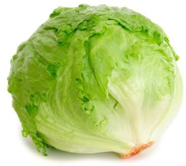

```{r setup, include=FALSE}
knitr::opts_chunk$set(echo = TRUE)
```

### Welcome to Text Analysis with R, Part 2! 

In Day 1 we went over preprocessing methods:

* Importing text from a variety of file formats. 
* Adjusting the character data in our text.
* Tokenization and stop word removal.

>In this session, we'll cover a few unsupervised, inductive approaches to text analysis. Mainly we'll be looking at term frequency, TF-IDF and Topic Modeling. 

Okay *lettuce begin!*


```{r, message=F}

# we start by loading packages 
if (!require("pacman")) install.packages("pacman")

pacman::p_load(
 tidyverse, reshape2, # wrangling 
 tidytext, topicmodels, # text
 viridis, wordcloud) # visuals

# options
options(scipen = 999)

```

#### Word and Document Frequency

A common question people ask of text is, "*what is this about*"? Term frequency (tf), or how often a word occurs in a document is a good starting point to exploring these questions. Let us explore term frequency in a collection of classical physics texts.  

```{r}
# import text from a csv file
phy_texts <- read_csv("data/classic_physics_texts.csv")

# we have an id variable, along with text and the author
phy_texts %>% head(10)
```


```{r}

# select text column without blank lines
phy_texts %>% select(text) %>% 
  na.omit()
```


```{r}

# group text lines by author and count lines. 
phy_texts %>% 
  group_by(author) %>% 
  summarise(lines_per_author = n())


```


```{r}


phy_texts_words <- phy_texts %>%
  # select the author and text columns 
  select(text, author) %>% 
  # tokenize the text
  unnest_tokens(word, text) %>%
  # include a count of tokens as they are grouped by author. 
  count(author, word, sort = TRUE)

phy_texts_words %>% head(15)

```

Next we are going to create a 

```{r}

# create a total_words object, grouped on the author level
total_words <- phy_texts_words %>% 
  group_by(author) %>% 
  summarize(total = sum(n))

# append the phy_text_words with the counts in total_words 
phy_texts_words <- left_join(phy_texts_words, total_words) %>% na.omit()

phy_texts_words %>% head()


```


>To understand what term frequency is, we divde the number of times a word appears in a novel  by the total number of words in that novel. 

```{r, warning=F}

ggplot(phy_texts_words, aes(n/total, fill = author)) +
  geom_histogram(bins = 40, show.legend = FALSE) +
  xlim(NA, 0.01) +
  facet_wrap(~author, ncol = 2, scales = "free_y")


```

What we get are left skewed distributions with long tails, including rare words that are not shown in the plot (toggle warning = T in the chart chunk for more info on that). What we see here is the measure of a diverse vocabulary, with many words occuring rarely and few that occur often. We also notice how the tf distributions of these texts are similar between authors. 

* What could a wide vocabulary say about a text, subject matter, or author?

* What sort of texts may have different distributions than what we see above, with like, more uses of like, one term or another, like ... (?) 

### TF-IDF

The output of a tf-idf score finds salient (important like) words for the content of each document by decreasing the weight for commonly used words and increasing the weight for words that are not used very much in a collection of documents. The [`bind_tf_idf()`](https://www.rdocumentation.org/packages/tidytext/versions/0.3.2/topics/bind_tf_idf) function is a simple, hands off way for us to generate tf-idf scores from tokenized text data.  

```{r}

phy_texts_tf_idf <- phy_texts_words %>%
  bind_tf_idf(word, author, n) %>%
  mutate(author = factor(author, levels = c("Galilei, Galileo",
                                            "Huygens, Christiaan", 
                                            "Tesla, Nikola",
                                            "Einstein, Albert")))

phy_texts_tf_idf %>% 
  select(author, word, tf_idf) %>% 
    arrange(desc(tf_idf))

```


```{r}

phy_texts_tf_idf  %>% 
  group_by(author) %>% 
  slice_max(tf_idf, n = 15) %>% 
  ungroup() %>%
  mutate(word = reorder(word, tf_idf)) %>%
  ggplot(aes(tf_idf, word, fill = author)) +
  geom_col(show.legend = FALSE) +
  labs(x = "tf-idf", y = NULL) +
  facet_wrap(~author, ncol = 2, scales = "free")

 
```

Interesting results! There looks to be some noisy terms in our lineup. After digging about we learn that "AB", "AC", "RC”, are names of rays, angles,and shapes in Huygens' writing. We also recognize the terms "co" and "ordinate" right next to each other in Einsteins' graph. After acknowledging these findings, our next step is to clean up our dataset to make some meaningfull visualizations. 

```{r}

phy_text_stop_words <- tibble(word = c("eq", "co", "rc", "ac", "ak", "bn", 
                                   "fig", "file", "cg", "cb", "cm",
                                    "ab", "_k", "_k_", "_x"))

phy_texts_words_clean <- anti_join(phy_texts_words, phy_text_stop_words, 
                           by = "word")


```


```{r}

tf_idf_viz <- phy_texts_words_clean  %>%
  bind_tf_idf(word, author, n) %>%
  mutate(word = str_remove_all(word, "_")) %>%
  group_by(author) %>% 
  slice_max(tf_idf, n = 15) %>%
  ungroup() %>%
  mutate(word = reorder_within(word, tf_idf, author)) %>%
  mutate(author = factor(author, levels = c("Galilei, Galileo",
                                            "Huygens, Christiaan",
                                            "Tesla, Nikola",
                                            "Einstein, Albert")))

ggplot(tf_idf_viz, aes(word, tf_idf, fill = author)) +
  geom_col(show.legend = FALSE) +
  labs(x = NULL, y = "tf-idf") +
  facet_wrap(~author, ncol = 2, scales = "free") +
  coord_flip() +
  scale_x_reordered()


```

### Topic modeling

The goal of topic models can be twofold: 

  1/ learning something about the topics themselves, i.e., what the the ext is about 
  2/ reduce the dimensionality of text to represent a document as a weighted average of K topics instead of a vector of token counts over the whole vocabulary. 
  
In the latter case, topic modeling a way to treat text as any data in a more tractable way for any subsequent statistical analysis (linear/logistic regression, etc).

There are many topic modeling algorithms, but we'll use LDA. This is a standard model to use. Again, the goal is not to learn everything you need to know about topic modeling. Instead, this will provide you some starter code to run a simple model, with the idea that you can use this base of knowledge to explore this further.

We will run Latent Dirichlet Allocation, the most basic and the oldest version of topic modeling

. We will run this in one big chunk of code. Our challenge: use our knowledge of scikit-learn that we gained above to walk through the code to understand what it is doing. Your challenge: figure out how to modify this code to work on your own data, and/or tweak the parameters to get better output.

First, a bit of theory. LDA is a generative model - a model over the entire data generating process - in which a document is a mixture of topics and topics are probability distributions over tokens in the vocabulary. The (normalized) frequency of word 𝑗
in document 𝑖 can be written as: 𝑞𝑖𝑗=𝑣𝑖1∗𝜃1𝑗+𝑣𝑖2∗𝜃2𝑗+...+𝑣𝑖𝐾∗𝜃𝐾𝑗 where K is the total number of topics, 𝜃𝑘𝑗 is the probability that word 𝑗 shows up in topic 𝑘 and 𝑣𝑖𝑘 is the weight assigned to topic 𝑘 in document 𝑖. The model treats 𝑣 and 𝜃

as generated from Dirichlet-distributed priors and can be estimated through Maximum Likelihood or Bayesian methods.

Note: we will be using a different dataset for this technique. The music reviews in the above dataset are often short, one word or one sentence reviews. Topic modeling is not really appropriate for texts that are this short. Instead, we want texts that are longer and are composed of multiple topics each. For this exercise we will use a database of children's literature from the 19th century.

The data were compiled by students in this course: http://english197s2015.pbworks.com/w/page/93127947/FrontPage Found here: http://dhresourcesforprojectbuilding.pbworks.com/w/page/69244469/Data%20Collections%20and%20Datasets#demo-corpora

That page has additional corpora, for those interested in exploring text analysis further.

1
Reference: Blei, D. M., A. Y. Ng, and M. I. Jordan (2003). Latent Dirichlet allocation. Journal of Machine Learning Research 3, 993–1022.

```{r}

childrens_lit <- read_delim("data/childrens_lit.csv.bz2", delim = "\t") %>% 
  na.omit() %>% select(-X1)

```

## Document-Term Matrices (DTM)

One of the most common structures that text mining packages work with is the document-term matrix (or DTM). This is a matrix where:

* each row represents one document (such as a book or article),
* each column represents one term, and
* each value (typically) contains the number of appearances of that term in that document.

Since most pairings of document and term do not occur (they have the value zero), DTMs are usually implemented as sparse matrices. These objects can be treated as though they were matrices (for example, accessing particular rows and columns), but are stored in a more efficient format. We’ll discuss several implementations of these matrices in this chapter.

DTM objects cannot be used directly with tidy tools, just as tidy data frames cannot be used as input for most text mining packages. Thus, the tidytext package provides two verbs that convert between the two formats.

tidy() turns a document-term matrix into a tidy data frame. This verb comes from the broom package (Robinson 2017), which provides similar tidying functions for many statistical models and objects.

cast() turns a tidy one-term-per-row data frame into a matrix. tidytext provides three variations of this verb, each converting to a different type of matrix: cast_sparse() (converting to a sparse matrix from the Matrix package), cast_dtm() (converting to a DocumentTermMatrix object from tm), and cast_dfm() (converting to a dfm object from quanteda).


```{r}

cl_tokens <- childrens_lit %>% 
  unnest_tokens(word, text)

cl_tokens
```


```{r}

digit_pattern <- '\\d+'

cl_custom_stop_words <- 
  bind_rows(tibble(word = c("a m", "a ve", "de", "en", "em", "ter", 
                            "gutenberg", "project"), 
                   lexicon = "custom"), 
                   stop_words)

```

```{r}

cl_tokens_clean <- cl_tokens %>% 
   mutate(word = str_replace_all(word, "[[:punct:]]", ""),
          word = str_replace_all(word, digit_pattern, ""),
          word = str_squish(word)) %>% 
  filter(word != "") %>% 
  anti_join(cl_custom_stop_words, by = "word")

cl_tokens_clean 

```


```{r}

cl_dtm <- cl_tokens_clean %>% 
  count(title, word) %>% 
  cast_dtm(title, word, n)

cl_dtm

```


```{r}

cl_lda <- LDA(cl_dtm, k = 2,
              control = list(seed = 1234))

cl_lda

```

That was the easy part! 

```{r}

cl_topics <- tidy(cl_lda, matrix = "beta") 
cl_topics

```

https://bookdown.org/Maxine/tidy-text-mining/latent-dirichlet-allocation.html


```{r}
cl_top_terms <- cl_topics %>%
  group_by(topic) %>%
  slice_max(beta, n = 10) %>% 
  ungroup() %>%
  arrange(topic, -beta)

cl_top_terms %>%
  mutate(term = reorder_within(term, beta, topic)) %>%
  ggplot(aes(beta, term, fill = factor(topic))) +
  geom_col(show.legend = FALSE) +
  facet_wrap(~ topic, scales = "free") +
  scale_y_reordered()

```


```{r}


beta_wide <- cl_topics %>%
  mutate(topic = paste0("topic", topic)) %>%
  pivot_wider(names_from = topic, values_from = beta) %>% 
  filter(topic1 > .001 | topic2 > .001) %>%
  mutate(log_ratio = log2(topic2 / topic1))
      
beta_wide 

```


```{r}

beta_wide %>% 
  top_n(20, abs(log_ratio)) %>% 
      ggplot(aes(y = fct_reorder(term, log_ratio),
                  x = log_ratio)) +
   geom_col(show.legend = FALSE) +
  labs(y = "",
       x = "log ratio of phi between topic 2 and topic 1 (base 2)")

```

Words in this graph measure the greatest difference in β between topic 2 and topic 1. What can we make of the differences between `log_ratio` values and the 2 topics our model put together? The results are fairly abstract, not what one may expect out of a statistcal data model. Consider the material being analyized. Children's books are stories composed mainly of abstract concepts. 

What if we ran a model like this on news articles, or scientific journals? Mabye try it on different chapters of a book by a single author? Do you think we would get a different quality of results to interpret? 


```{r}

tidy(cl_lda, matrix = "gamma") %>% 
  group_by(topic) %>%
  top_n(15) %>% 
  mutate(document = as.character(document)) %>% 
  acast(document ~ topic, value.var = "gamma", fill = 0) %>% 
  comparison.cloud(colors = c("gray20", "gray80"), scale = c(.8, 1))

```

With this data frame and the `comparison.cloud` function, we can explore which document is 
more charateristic of each topic.


